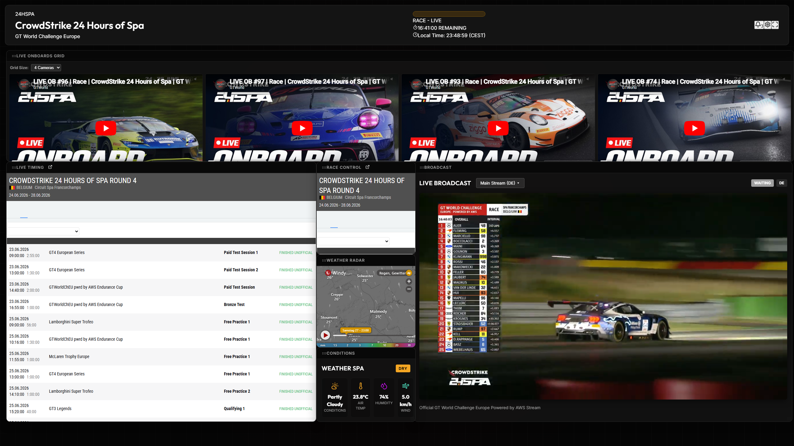

# 24H Spa Live Dashboard



A modular, drag-and-drop live telemetry and streaming dashboard built specifically for the CrowdStrike 24 Hours of Spa.

## Features

- **Draggable & Resizable Widgets**: Fully customizable layout powered by `react-rnd`. Layouts are automatically saved locally.
- **Live Timing Integration**: Embeds the official Swiss Timing live feed, bypassing client-side iframe restrictions.
- **Race Control**: Direct official notifications embedded alongside timing.
- **Accurate Track Weather**: Uses localized Circuit de Spa-Francorchamps weather data via the `yr.no` API.
- **Windy Radar**: Live precipitation radar overlay.
- **Live Onboards & Broadcast**: Integrated streaming views for a complete race center experience.
- **Layout Profiles**: Export your custom dashboard layout as a JSON file and share it with others. 
  - 📥 **[Download Example Profile (Pono1012's Layout)](public/dashboard-profile.json)**
    *(Import this file via the Settings menu in the dashboard!)*

## Tech Stack

- React 19
- Vite
- Lucide React (Icons)
- Vercel Serverless (for proxy routing in production)

## A Note on Timing71

Many fans prefer [Timing71](https://www.timing71.org/timing/28e5b058-ccff-4e58-adcc-92800908329f) for their live telemetry. Unfortunately, due to strict `X-Frame-Options` and `Content-Security-Policy` headers set by the Timing71 servers, it is technically impossible to safely embed their application inside an `<iframe>` within this dashboard. As an alternative, this dashboard integrates the official Swiss Timing feed (bypassing their client-side restrictions via a custom proxy) and provides a direct pop-out link to Timing71 in the panel header.

## Local Development

To run the dashboard locally:

1. Clone the repository
2. Install dependencies:
   ```bash
   npm install
   ```
3. Start the Vite dev server:
   ```bash
   npm run dev
   ```
4. Open `http://localhost:5173` in your browser.

*Note: The local Vite proxy is configured to automatically rewrite Swiss Timing security checks and bypass Yr.no CORS restrictions.*

## Live Demo

🚀 **[View the Live Demo on Vercel](https://24hspa-dash.vercel.app/)**

This project is fully configured to run on Vercel. 
The repository includes `vercel.json` and a Serverless Function (`api/swisstiming-bypass.js`) to perfectly replicate the local development proxy (for Swiss Timing and Yr.no) in a production environment.
